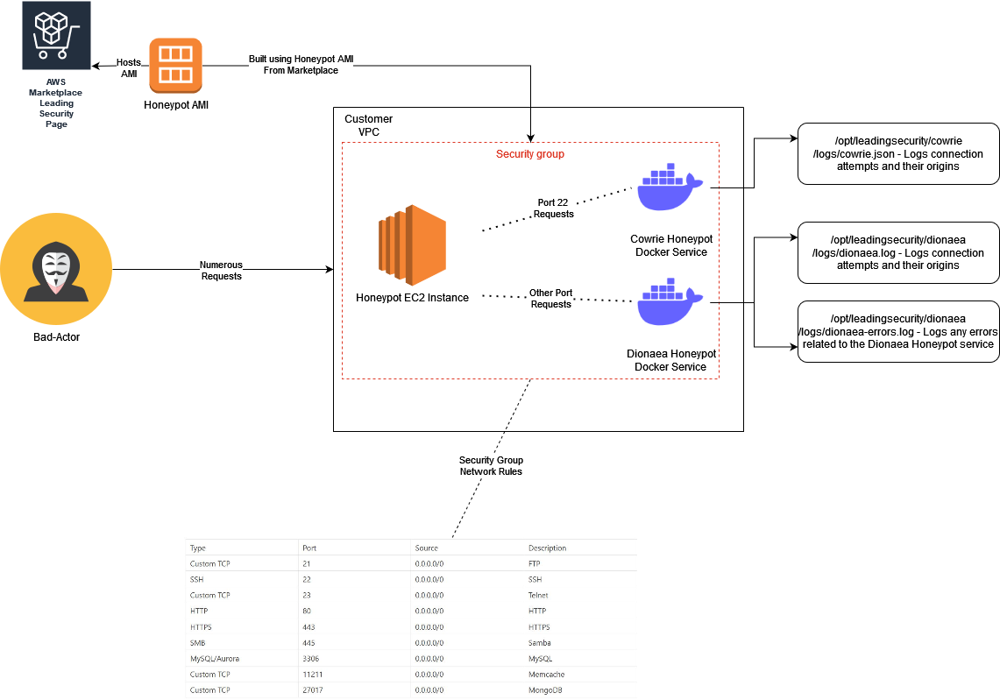

What is the Leading Security Honeypot AMI

The Leading Security Honeypot AMI is a lightweight, STIG hardened AMI built on top of a base Ubuntu 20 or Ubuntu 22 image. It consists of a set of services designed to emulate other services to be able to track and monitor potential malicious activities in a network where such threats need to be made visible. The following services are currently deployed within the Honeypot AMI with a list of the services they are also emulating as well: 

Cowrie (Credit: https://github.com/cowrie/cowrie):
SSH

Dionaea (Credit: https://github.com/DinoTools/dionaea):
Telnet
FTP
HTTP
MySQL
Memcache
SAMBA/SMB

TFTP

UPNP

When requests go to these particular services that are being emulated, log files will be generated in a consistent location under /opt/leadingsecurity/cowrie/logs and /opt/leadingsecurity/dionaea/logs

The following log files will be produced by the Cowrie and Dionaea services:

Cowrie: 

/opt/leadingsecurity/cowrie/logs/cowrie.log - Syslog RFCX format - Details service events, access events including payload information of the attacker, their IP address, credentials used etc.

/opt/leadingsecurity/cowrie/logs/cowrie.json - Standard JSON format - Details service events, access events including payload information of the attacker, their IP address, credentials used etc, in a format that works with a majority of SIEM and Log Ingestion systems

/opt/leadingsecurity/cowrie/lib/tty - Session logs from any attackers that have attempted to access the Honeypot via SSH (TBD)

/opt/leadingsecurity/cowrie/lib/downloads - Any files that have been transferred by the attacker to the honeypot will be stored here.  (TBD)

Dionaea:

/opt/leadingsecurity/dionaea/logs/dionaea.log - Syslog RFCX format - Details service events, generates incidents and payload information when one of the services is accessed including information about the service accessed, origin IP address, any credentials used etc.

/opt/leadingsecurity/dionaea/logs/dionaea_error.log - Details service errors related to the Dionaea service and the emulated services 

The following Diagram provides a high-level overview of a simplified deployment:

Deploying the Honeypot AMI
Deployment Recommendations:

To run and deploy the Honeypot AMI, we recommend choosing to deploy this into a VPC where a majority of your internet facing traffic comes from or a network you have identified as being critical and vulnerable. This will enable you to catch bad actors and attackers coming into your networks and give you the information to allow you to block and protect yourself from these types of attacks. 

We also recommend that any monitoring and vulnerability scanning systems that you may have in place can still be used with this product but exceptions will have to be made in those systems when vulnerabilities are identified with the Honeypot AMI with regards to the services noted above that are being emulated.

Deployment Steps: 

To deploy the Honeypot AMI, you need to navigate to the following page and click install AMI which will redirect you back to your AWS Console: 

<Marketplace Link here> 

Alternatively, you can go to AWS Console -> EC2 -> Instances -> Launch Instances -> Under Application and OS images in the search bar use one of the following AMI IDs:

Ubuntu 20 ID: <>

Ubuntu 22 ID: <>

You can then select the instance size and type that you require, we currently recommend a minimum of a t2.micro but if this is a particularly traffic heavy network and instance, then scale to an instance size as required. 

Next, depending on whether you want the ability to access the instance via SSH, you will need to associate an SSH key-pair at this stage. 

Next make sure you attach a security group with the following security group rules: 

Type
	Port
	Source
	Description

Custom TCP
	21
	0.0.0.0/0
	FTP

SSH
	22
	0.0.0.0/0
	SSH

Custom TCP
	23
	0.0.0.0/0
	Telnet

HTTP
	80
	0.0.0.0/0
	HTTP

HTTPS
	443
	0.0.0.0/0
	

HTTPS

SMB
	445
	0.0.0.0/0
	

Samba

MySQL/Aurora
	3306
	0.0.0.0/0
	

MySQL

Custom TCP
	11211
	0.0.0.0/0
	

Memcache

Custom TCP
	27017
	0.0.0.0/0
	

MongoDB

Additionally, if you want to allow direct SSH access to the Honeypot host itself you will need to add the following additional security group rule, please ensure that this is restricted to a known bastion host or network and not on 0.0.0.0/0 as you do not want to open up the real SSH service to the world: 

Type
	Port
	Source
	Description

Custom TCP
	52222
	<Your VPN/Internal Network/Public IP address>
	SSH to Honeypot Instance

After configuring an appropriate security group, you will then be required to select an amount of storage to allocate to the instance. By default this will be 8GB as the EC2 instance itself is minimal in nature and gives enough headroom to store a sufficient amount of logs. If this instance is going to be used for a longer period of time, we recommend allocating some more storage space if logs are not going to be moved and deleted.

You should then be able to click create instance at which point your EC2 will start to provision and AWS will provide you an instance ID. You can check the status of the instance by going to EC2 -> Instances -> Search Bar -> Your instance ID provided earlier or by clicking on the instance ID AWS provided when you clicked create instance.

Migrating logs to Cloudwatch

Migrating logs to ElasticSearch

FAQ/Troubleshooting
Q: How do I check the running status of the Honeypot services?

To check the running status of the Honeypot services, you will need to SSH into instance as the Ubuntu user using an SSH key-pair you have associated with the instance. Once you have done this run the following commands:

If the services are running you should an output similar to the following: 

Q: How do I restart the Honeypot Services?

To restart the Honeypot services, you will need to SSH into the instance as the Ubuntu user using an SSH key-pair you have associated with the instance. Once you have done this run the following commands:

Once you are in as the root user, you will then need to run the following set of commands, this will change into the directory where the docker compose file for the Honeypot services exist and perform a restart:

If this worked you should be able to run the following commands which should output a list of running services from Docker:

Q: I am unable to SSH into the Honeypot Services 

First thing is to verify that you have opened TCP Port 52222 on the security group that is attached to the instance. Additionally ensure that the source for this port matches or includes the IP address range that you are trying to access the instance from. 

If the security group looks ok, next ensure that you have associated an SSH key-pair with the instance. If this was not done at launch time you will have to recreate the instance and ensure that this is attached at launch time.

Q: I want to access the logs but don't have access to the instance anymore.

In the case where you no longer have access or a need for the Honeypot instance but still wish to get information such as logs or any files from the instance, you can do so by shutting down the instance and then on the storage tab for that instance clicking on the storage device attached to the instance that will be labelled "/dev/sda1". You can then click actions and then detach the volume from the instance. You can then attach this volume to another instance and mount this on the filesystem and access the logs from there. 
